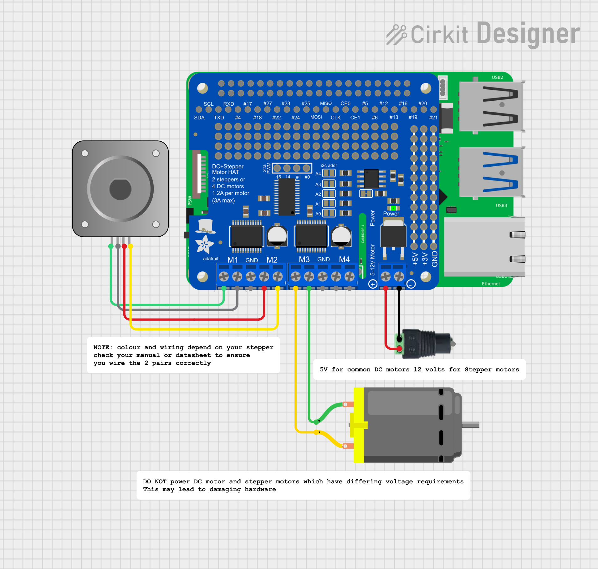

# Adafruit DC and Stepper Motor HAT

This samples shows how to control either a stepper or DC motor using the Adafruit DC and Stepper Motor HAT on a Raspberry Pi using QNX.

## Usage
This hardware sample is broken into 3 components:
- A core library `libadafruit-motorkit` which can be reused in your own projects.
- A test application `adafruit-dc-motor-test` used with DC motors.
- A test application `adafruit-stepper-test` used with stepper motors.

Once compiled and copied to the target they can be run to move the stepper or DC motor. If wired correctly it should spin forwards than backwards

## Improving performance
In order to get the best performance out of the motor kit it is recommended to increase the baud rate of the I2C to 1Mhz.

This can be done by updating to `-c1000000000` in `/system/etc/startup/post_start.sh`:42
```
on -u 0:525 /system/bin/i2c-dwc-rpi5 -p0x1f00074000 -c1000000000 -q0xa8 --u1
```

## Schematic Diagrams and Wiring
> NOTE it is not recommended to control both a stepper and DC motor at the same time off the hat unless they share the same voltage requirements.



