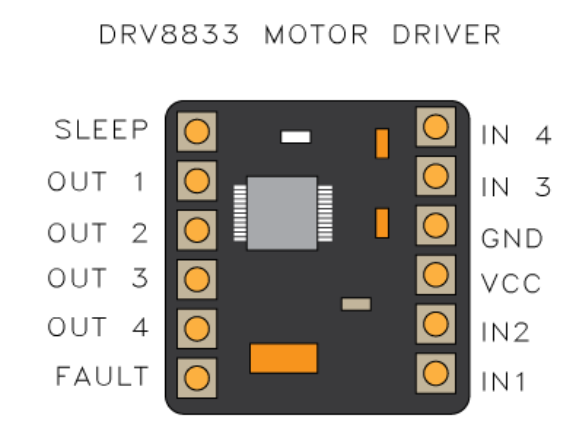
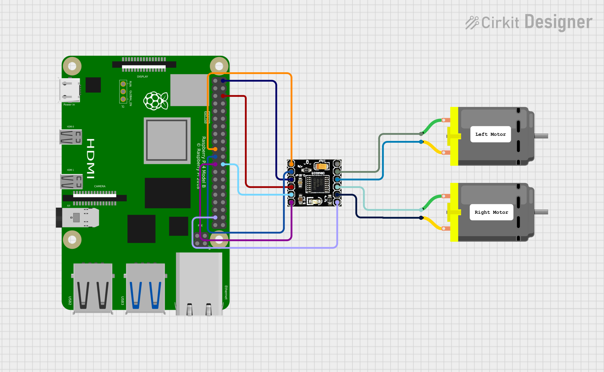

### Motor Control Sample
This demo shows how to control dc motors using a standard motor controller. This code uses the `DRV8833PWP` dual motor controller to control to motors, but the method should be similar for other motor drivers. This program drives the motors forward, backwards, left and right

Below is the schematic diagram of the motor controller. 

## Pin Configuration:
- Sleep: It is the enable pin of the driver (GPIO 26)
- The inputs to IN 1 are reflected on the OUT 1 pin
    - Same goes for all the other IN and OUT pin pairs
- OUT 1 is connected to the positive terminal of the right motor
- OUT 2 is connected to the negative terminal of the right motor
- OUT 3 is connected to the positive terminal of the left motor
- OUT 4 is connected to the negative terminal of the left motor
- IN 2: Connected to GPIO: 10
- IN 4: Connected to GPIO: 9
- IN 3: Connected to GPIO: 8
- IN 1: Connected to GPIO: 11

## Schematic Diagram
