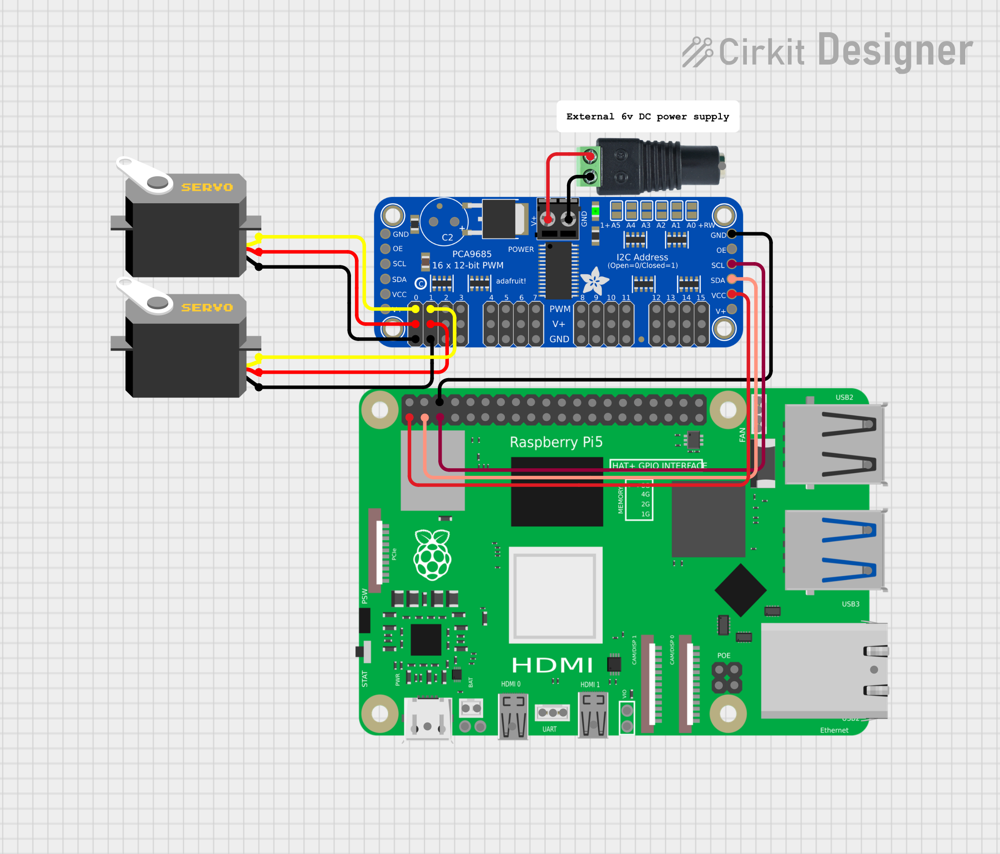

# PCA9685 PWM Servo Controller Hardware Sample

This sample shows how to control multiple servos using the PCA9685 16 channel PWM controller on a Raspberry Pi using QNX. 

## Usage
This hardware sample is broken into 2 components: a binary pca9685-servo-controller, and a library `libpca9685` which can be used in your own projects.

To control the servo once connected to power run the following commands:
```shell
# Setting specific pins

## Middle (Servo 1)
./pca9685-servo-controller -f 50  0 800 500
## Highest Value (Servo 0)
./pca9685-servo-controller -f 50  0 1000 500 -f 50 1000
## Lowest Value (Servo 1)
./pca9685-servo-controller -f 50  1 600 500

## Setting all pins to idle
./pca9685-servo-controller -f 50 0 0 

# For more options
./pca9685-servo-controller -h
```

## Pin Configuration

PCA9685 as follows (where NC means not connected):

- PCA9685 GND to GND (pin 6)
- PCA9685 OE NC
- PCA9685 SCL to I2C1 SCL (pin 3)
- PCA9685 SCA to I2C1 SCA (pin 2)
- PCA9685 VCC to 3.3v (pin 1)
- PCA9685 V+ NC

Power wiring (Green Power Terminal)
> NOTE: Do NOT power it directly off of the Raspberry Pi
- PCA9685 V+ to 6v external power connector positive terminal
- PCA9685 GND to 6v external power connector negative terminal

## Schematic Diagrams

